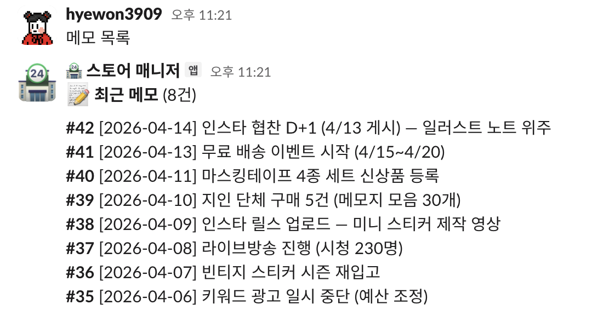
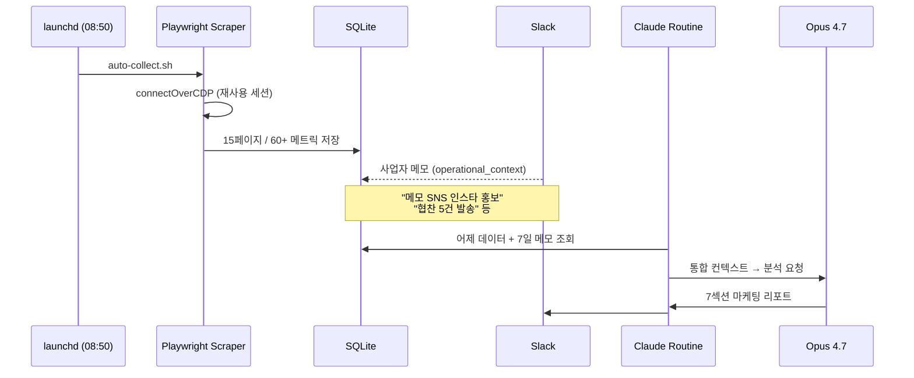
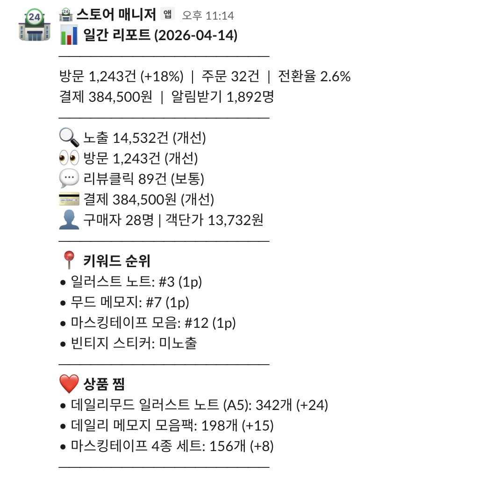
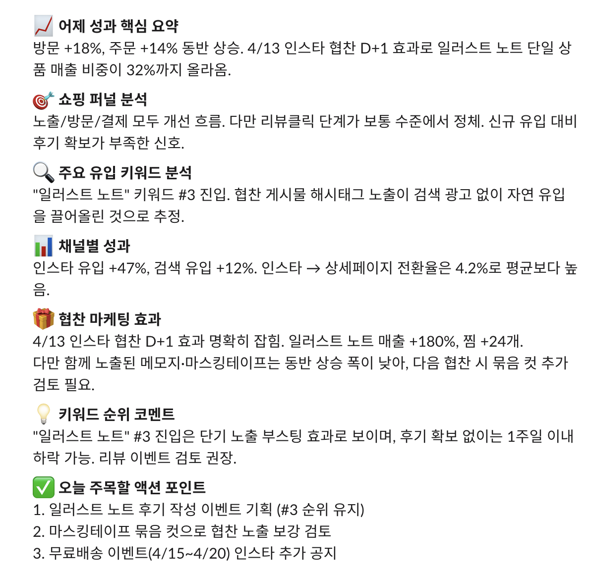
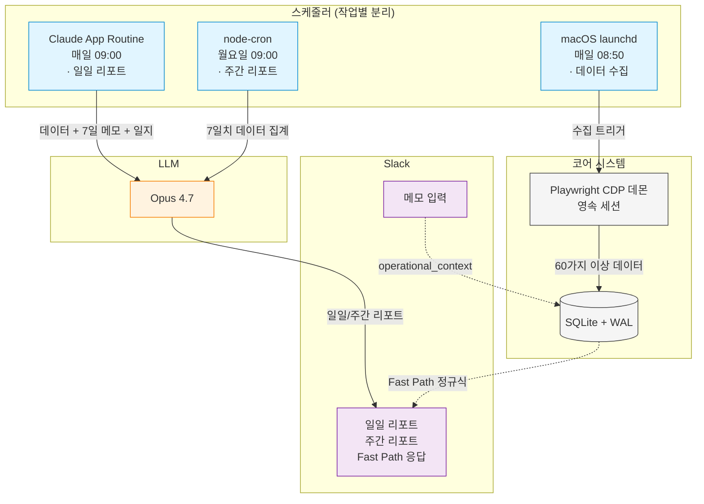
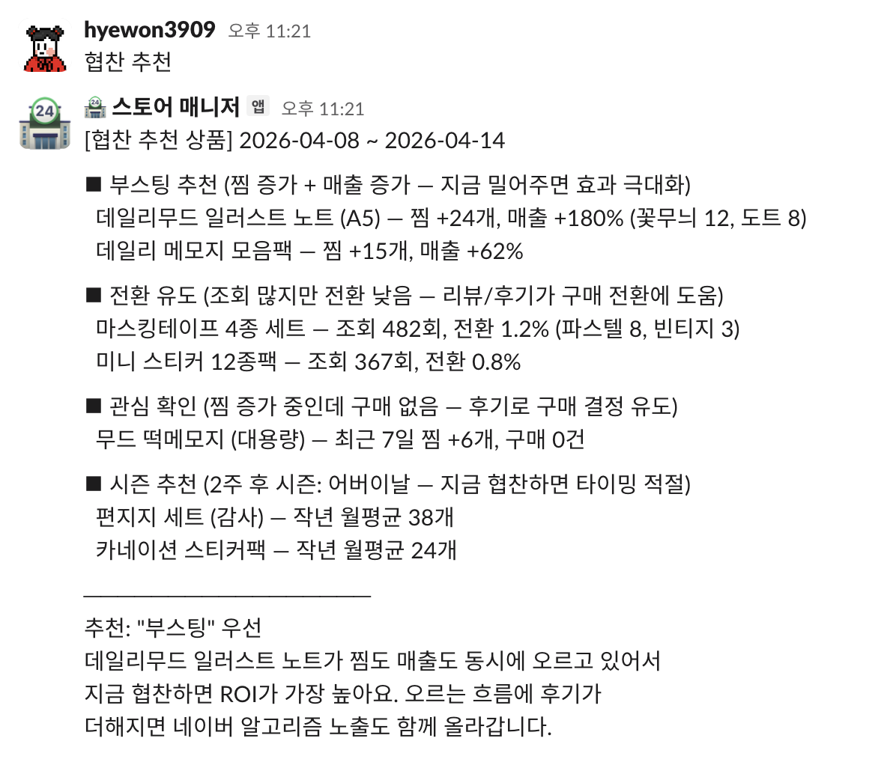

<p align="center"><sub>※ 이 저장소는 코드가 아닌 프로젝트 설명 문서입니다. 실제 구현은 비공개 저장소에 있습니다.</sub></p>

# 스마트 스토어를 매일 분석해주는 LLM 에이전트

- **데이터 자동 수집** — 매일 아침 60가지 이상의 스마트스토어 데이터 수집
- **LLM 분석** — Claude Opus가 데이터를 종합 분석한 마케팅 리포트를 Slack으로 전송
- **메모 컨텍스트** — SNS 홍보·협찬·지인 단체 구매 같은 사업자 활동을 메모 한 줄로 분석에 반영
- **1인 운영** — 기획·운영·분석까지, 2026-03 시작 후 매일 사용 중

---

## 배경

스마트스토어 대시보드도 자체 인사이트(매출·방문자수 추이, 키워드 인기 순위 진입 등)를 제공한다. 다만 마케팅에 활용할 수 있는 데이터는 그보다 더 다양하고(상품별 조회수·유입 키워드·키워드 순위·유입 채널 등), 페이지마다 흩어진 데이터를 다양한 조합으로 엮어 더 깊은 인사이트를 뽑아내는 것은 마케터가 따로 없는 1인 운영자에게 큰 부담이 된다. 일부 메트릭은 추이 없이 당일 데이터만 노출되어, 매일 직접 누적하지 않으면 추적이 불가능하기도 하다. 외부 AI 도구를 이용해 인사이트를 추출하려고 해도 매번 데이터를 손으로 입력해야 하고, 무엇보다 **사업자가 SNS 홍보·협찬·지인 단체 구매 같은 활동을 매번 LLM에 알려주기 어렵기 때문에, 주문 증가가 협찬 효과인지 오가닉 트래픽인지 잘못 해석할 수 있다.**

그래서 이 시스템은 수집·통합·해석을 자동화하고, Slack 한 줄 메모로 사업자 활동을 분석 컨텍스트에 자동 주입하도록 만들었다.

---

## 이 프로젝트의 핵심

### 1. 사람처럼 맥락을 이어가는 두 축의 메모리

이 시스템의 출발점은 **AI 에이전트가 정말 한 명의 직원처럼 행동할 수 있을까?** 라는 질문이었다. 비전문 분야인 마케팅을 맡아줄 인력이 필요했고, 그 자리를 AI 에이전트로 채워볼 수 있는지 직접 실험해보고 싶었다.

그래서 단발성 분석에 그치지 않도록 두 축의 누적 메모리로 매일 분석에 연속성을 만들고, 사람 분석가가 직접 분석하듯이 며칠째 추적 중인 이슈를 기억하도록 설계했다.

#### 축 1 — 사업자 메모: 외부 활동을 분석에 주입

스마트스토어 데이터에는 잡히지 않는 사업자의 외부 활동(SNS 협찬, 지인 단체 구매, 오프라인 이벤트 등)을 메모 한 줄로 분석에 반영한다.

사업자가 Slack에 `메모 SNS 인스타 홍보`, `메모 협찬 5건 발송`, `메모 지인 30명 단체 구매` 같은 한 줄을 남기면 fast path 정규식 매칭으로 `operational_context` 테이블에 즉시 저장된다 — LLM 호출 없이 DB에 직접 저장하는 방식이라 입력 부담을 최소화했다.

분석 시점에는 최근 7일치 메모를 조회해 입력 파일에 자동 삽입한다. 최근 1주일의 사업자 활동이 늘 분석 컨텍스트에 들어 있는 상태가 되어, 별도 입력 없이도 LLM이 매번 인오가닉 요인을 함께 본다.

<p align="center">
  
</p>

<p align="center"><sub>※ 이 README의 모든 캡처는 시스템이 실제로 출력하는 응답 포맷 그대로이며, 안의 브랜드·상품명·수치만 가상 데이터("데일리무드" / 문구 팬시류)로 치환한 예시입니다.</sub></p>

#### 축 2 — 에이전트 일지: 분석가의 자체 관찰 누적

매일 분석을 마친 에이전트가 그 날의 일지를 직접 누적 기록한다. 사람 분석가가 노트에 추적 사항을 적어두는 방식을 그대로 옮긴 구조 — 에이전트를 **사람처럼** 맥락을 이어가게 만들기 위한 핵심 장치.

매일 엔트리는 4개 섹션으로 구성된다:

- `오늘 발견한 것` — 어제 데이터에서 직접 찾은 패턴·이상치
- `추적중인 이슈` — 며칠째 이어지는 이슈 (예: **전환 직전 8일째**, **키워드 점검 31일째 미해결**)
- `제안한 액션` — 구체적으로 제안한 실행 항목
- `다음 확인 사항` — 내일 우선적으로 살펴볼 포인트

최근 7일치 일지는 매일 분석 시 LLM 컨텍스트로 함께 로드되고, 7일 초과 엔트리는 월별 파일(`analyst-monthly/2026-04.md` 등)로 자동 이동되어 장기 추세 분석에 참조 가능. 이 구조 덕분에 에이전트가 **N일째 미실행**, **전주 대비 전환 패턴 변화** 같은 시간 차원의 해석을 할 수 있다.

#### 효과 — 두 축이 함께 작동할 때

같은 데이터, 같은 LLM이라도 두 축의 메모리로 분석 결론이 갈린다.

**축 1 — 메모로 인오가닉 요인 분리**

사업자 메모: `메모 4/27 방문 폭증은 SNS 협찬 효과. 일회성이라 오가닉으로 분류하지 말 것`

| 메모 없을 때 분석 | 메모 반영 분석 |
|---|---|
| "방문 140건(+400%) — 갑작스러운 유입 증가, 원인 후속 분석 필요" | "방문 140건(+400%) — **협찬 일회성 효과 잔여로 확정.** 4/28엔 평소 수준(29pv)으로 복귀해 정상 추이로 판단" |
| "찜 +1 안정적이지만 결제 0원 이틀째라 모니터링 필요" | "결제 0원은 협찬과 무관한 **상시 전환 이슈로 분리해 추적**" |

같은 숫자에 대한 해석이 메모 한 줄로 갈린다.

**축 2 — 일지로 시간 차원 추적**

매일 누적된 일지가 분석 컨텍스트에 들어오면 분석은 단발 보고를 넘어 며칠째 이어지는 패턴까지 직접 짚어낸다.

| 일지 없을 때 분석 | 일지 반영 분석 |
|---|---|
| "네이버페이 장바구니 보관 고객 1명 — 전환 직전 행동" | "네이버페이 장바구니 고객 **8일째 재방문, 전환 미완 지속** — 결제 직전 막히는 패턴 추적 중" |
| "키워드 '끈갈피' 검색 노출 미확인 — 추가 조사 필요" | "**31일째 미해결**: expose 데이터에서 16~19위로 포착되나 스크래퍼 미노출. 직접 검색 1분이면 해결 가능" |

외부 AI 도구로는 분리할 수도, 누적할 수도 없는 두 축 차별점.

---

### 2. 4단계 자동 분석 파이프라인

매일 아침 자동으로 흐르는 파이프라인.



1. **데이터 수집** — `launchd` 트리거 → `auto-collect.sh` → Playwright CDP 데몬에 `connectOverCDP`로 연결해 세션 재사용 → 스크래핑 → SQLite 저장
2. **메모 컨텍스트 통합** — `operational_context` 테이블에서 7일 윈도우 조회 → daily-report-input.md에 자동 통합
3. **LLM 분석** — Claude 앱 `store-morning-briefing` Routine이 입력 파일을 읽고 Opus 4.7에게 분석 요청 → 60+ 메트릭 + 어제 대비 변화율 + 7일 메모 종합 → 7섹션 리포트 생성
4. **자동 발송** — `post-daily-report` 스크립트가 Slack `#스토어-매니저` 채널로 자동 전송

<p align="center">
  
  
</p>

<p align="center"><sub>※ 응답 포맷은 실제 시스템 출력 그대로, 안의 데이터만 가상 치환.</sub></p>

---

### 3. 영속 세션 + 자체 추이 누적

시스템은 **일일 리포트**와 **주간 리포트** 두 가지를 자동으로 생성하며, 각 작업의 성격에 맞춰 스케줄러를 따로 두고 운영한다.



**Playwright CDP 데몬 — 영속 세션 + 자동 복구**

스마트스토어는 세션 만료가 잦다. 수동 로그인 1회만으로 매일 자동 수집을 살리려면 단순 `storageState` 저장만으로는 부족했다. **데몬 + CDP 재사용 + storageState 직접 사용** 결합으로 안정화하기까지 여러 차례 구조 조정. **안정화 이후 몇 주째 수동 개입 없이 자동 운영 중.**

- **데몬이 세션 보유** — `launchPersistentContext(userDataDir)`로 데몬 1개가 브라우저를 상시 유지
- **CDP 재사용** — 스크래퍼는 `connectOverCDP`로 데몬에 연결, 매 실행마다 로그인 생략
- **storageState 직접 사용** — 데몬 재시작에도 로그인 상태 복원 (데몬 쿠키 추출 우회 결정)
- **세션 만료 자동 복구** — 만료 감지 시 Slack 알림 + 재로그인 안내 → 1회 수동으로 다시 살림
- **launchd가 데몬 상시 유지** — 데몬이 죽으면 OS 레벨에서 자동 재기동

**데이터 수집 — 외부에 없는 추이를 자체 누적**

대시보드 일부 메트릭(알림받기 수, 방문수, 상품 찜수)은 **당일 데이터만 노출되고 추이가 없다**. 추이가 필요하면 매일 직접 수집해 DB에 쌓는 수밖에 없음. 외부 AI 도구나 1회성 캡처로는 만들 수 없는, **매일 운영하면서 쌓이는 분석 자산**.

- **iframe 데이터 수집 안정화** — 비즈어드바이저는 SPA 위에 데이터가 iframe으로 렌더링되는 구조다. 같은 iframe section을 공유하는 페이지 사이를 이동할 때 이전 페이지의 stale frame이 잡혀 "Frame was detached" 오류가 누적됐고, 거기에 `networkidle` 대기까지 백그라운드 polling 때문에 매번 30초 timeout을 일으켰다. 이를 해결하려고 `navigateAndGetFrame` 공통 헬퍼로 일괄 마이그레이션했다 — `domcontentloaded`로 진입한 뒤 `evaluate` 호출로 frame alive를 직접 검증하고, 실패 시 짧은 재시도 1회. 이후 모든 페이지 수집이 안정화됐다.
- **상품 찜수 — 비공개 endpoint 활용** — 대시보드에 상품별 찜수 추이가 없고, 상품 상세 페이지는 한 상품씩만 노출한다. 스마트스토어가 내부적으로 호출하는 keeps endpoint(JS에서 fetch하는 비공개 JSON 응답)를 그대로 활용 — 추적 상품 여러 개의 찜 카운트를 한 번의 응답으로 받아온다. 로그인된 페이지 컨텍스트에서 fetch하므로 세션 쿠키가 자동 포함되며, HTML 파싱·DOM 크롤링 없이 JSON으로 직접 받는다.
- **수집 완전성 검증** — 매일 수집 후 누락 검사 → 불완전 시 Slack 에러 알림 → 다음 날 자동 백필

**작업 라이프사이클별 스케줄러 분리**

스케줄러를 하나로 통일하지 않고 작업 성격에 맞춰 분리. 한쪽 장애가 다른 작업까지 정지시키지 않도록 작업별로 격리했다.

| Scheduler          | 사용처                       | 분리 이유                                                  |
| ------------------ | ---------------------------- | ---------------------------------------------------------- |
| macOS launchd      | 데이터 수집·데몬 상시 유지   | Slack bot이 죽어도 OS 레벨에서 무조건 실행되어야 하는 백본 |
| Claude App Routine | 일일 LLM 분석 트리거         | LLM 분석은 외부 작업, 앱 단위 스케줄                       |
| node-cron          | 주간 리포트                  | Slack bot 활성 상태에서만 의미 있는 작업                   |

**SQLite WAL + 다층 백업**

운영 데이터 손실은 1인 운영의 약점이라 백업 전략을 따로 설계했다.

- **WAL(Write-Ahead Logging) 모드** — SQLite 저널 모드 중 하나. 모든 쓰기를 별도 `.db-wal` 로그 파일에 먼저 기록한 뒤 본 DB에 반영하는 방식. 동시 읽기/쓰기 충돌을 줄이고, 크래시 시 WAL 로그로 복구 가능.
- **`wal_checkpoint(TRUNCATE)` 후 파일 복사** — 본 DB 파일만 그대로 복사하면 WAL에 남아 있던 미반영 쓰기가 빠져 백업 시점이 어긋난다. checkpoint로 WAL 변경분을 본 DB에 강제 반영하고 WAL 파일을 비운 뒤 복사해야 일관된 시점의 스냅샷이 만들어진다.
- **다층 보관** — 로컬 `backups/` 디렉토리에 최근 10개 자동 보존(그 이상은 자동 정리), 추가로 Google Drive 외부 동기화로 로컬 디스크 손실 대비.

---

### 4. 비용·품질 제어

일일·주간 분석은 매일 자동으로 흐르는 비동기 일괄 작업이라 실시간 응답 속도 트레이드오프가 없다. 반면 인오가닉 분리는 추론 품질이 결정적이라 일일·주간 모두 **Opus 4.7 고정**, 비용은 두 갈래로 제어.

**프롬프트 캐싱 — Anthropic ephemeral**

브랜드 바이블·역할 프롬프트처럼 거의 변경되지 않는 컨텍스트는 `cache_control: ephemeral`로 캐시한다. 매일 갱신되는 분석 입력(데이터·메모)은 캐싱하지 않는다. 반복 호출 시 입력 토큰 비용을 절감.

**Fast Path — 정규식 → DB**

자주 쓰는 명령어(`매출`, `인기 상품`, `주간 리포트`, `협찬 추천`, `메모 {내용}`)는 정규식 매칭 → DB 직접 조회로 LLM 우회. 단순 조회는 \~1초 응답. `협찬 추천`처럼 사전 정의된 분류 규칙(부스팅 / 전환 유도 / 관심 확인 / 시즌 추천)이 있는 분석도 LLM 없이 SQL + 규칙 기반 로직으로 처리한다. 분석 깊이가 필요한 자유 질문만 LLM 호출.

<p align="center">
  
</p>

<p align="center"><sub>※ 응답 포맷은 실제 시스템 출력 그대로, 안의 데이터만 가상 치환.</sub></p>

---

### 5. 1인 운영 + AI 협업 파이프라인

기획·메트릭 선별·설계·구현·운영·분석까지 혼자. Claude Code의 기능을 조합해 개발 프로세스 자체를 자동화한다.

```
/design  →  .claude/plans/  →  /compact  →  /build
  설계·인터뷰    계획서 핸드오프    컨텍스트 정리    구현·리뷰·PR
```

- **Custom Skills**: `/design`, `/build` — 계획서 파일로 세션 간 핸드오프
- **Hooks**: 커밋 전 시크릿 스캔
- **ADR (Architecture Decision Records)**: 되돌리기 어려운 설계 판단을 표준 포맷(Status·Context·Decision·Consequences = 상태·배경·결정·결과)으로 기록

AI를 코딩 보조가 아니라 협업 개발자로 취급하고, **시스템 설계·메트릭 선별·운영 판단은 직접 주도**한다.

---

## 멀티 에이전트 아키텍처

확장 가능한 도메인 분리 구조로 설계했다. 도메인 에이전트들이 오케스트레이터를 통해 자율 협업하며 운영을 처리하는 구조를 목표로, 각 에이전트를 단계적으로 완성해나가는 중. 현재 **데이터 분석·매출** 두 도메인이 운영 중이고, 나머지 세 도메인(**콘텐츠·스토어 운영·오케스트레이터**)은 앞으로 진행할 예정이다.

| 에이전트              | 상태           | 역할                                            |
| --------------------- | -------------- | ----------------------------------------------- |
| 데이터&nbsp;분석      | 운영&nbsp;중   | 매일 60가지 이상의 데이터 수집 → 종합 마케팅 리포트 |
| 매출                  | 운영&nbsp;중   | 네이버 스마트스토어·쿠팡·오프라인 등 다채널 판매 데이터를 별도 매출 추적 프로젝트에서 통합 → Slack fast path로 매출·손익 즉시 응답 |
| 콘텐츠                | 진행&nbsp;예정 | 사진 라이브러리 자동 분석·태깅 → 어떤 사진·메시지를 SNS에 쓸지 마케팅 콘텐츠 제안 |
| 스토어&nbsp;운영      | 진행&nbsp;예정 | 데이터 분석 에이전트 제안을 받아 검색 태그·상품 정보 등 스토어 설정 직접 수정 |
| 오케스트레이터        | 진행&nbsp;예정 | 도메인 에이전트 라우팅 + 멀티 에이전트 협업     |

확장 시 도메인별 에이전트는 동일 인프라(SQLite + Slack + LLM 호출 레이어)를 공유하되, 시스템 프롬프트와 도메인 도구만 다르게 가져가는 구조다.

---

## 기술 스택

| 영역       | 선택                                                          |
| ---------- | ------------------------------------------------------------- |
| AI/LLM     | Claude Opus 4.7 + Prompt Caching (ephemeral)                  |
| Runtime    | Node.js 22 + TypeScript (ESM)                                 |
| Messaging  | Slack Bolt (Socket Mode + Block Kit)                          |
| Database   | SQLite (better-sqlite3, WAL mode)                             |
| Browser    | Playwright (CDP, persistent context, storageState 영속화)     |
| Schedulers | macOS launchd · Claude App Routine · node-cron                |
| AI 개발    | Claude Code — Custom Skills · Hooks · ADR 워크플로우          |

### 주요 기술 선택 근거

**Database — SQLite (vs 매니지드 PostgreSQL)**

1인 + 단일 머신 + 외부 노출 없는 시스템에 클라우드 매니지드 DB는 오버스펙. 무료 한도·서비스 의존성 위험도 따라온다.

- 백업이 `wal_checkpoint(TRUNCATE)` + `cp` 한 줄, Google Drive 동기화로 외부 백업 자동
- 동기 호출이라 RTT 0. LLM·스크래퍼 대비 DB는 항상 가장 빠른 단계
- WAL 모드로 동시 읽기 충분, 쓰기는 launchd 단일 컨텍스트라 락 충돌 없음

**Messaging — Slack Bolt Socket Mode (vs Webhook)**

운영 환경이 외부 inbound 트래픽을 받지 않는 로컬 머신이라 webhook 방식은 적합하지 않다. Socket Mode는 outbound 웹소켓만 쓰니 방화벽·포트 포워딩·도메인·HTTPS·리버스 프록시 모두 불필요해 운영이 단순해진다.

**Runtime — Node.js + TypeScript**

LLM API 호출과 도메인 로직이 시스템의 대부분이라, 60가지 이상의 메트릭 스키마와 LLM 도구 인터페이스를 타입으로 안전하게 관리할 수 있는 점을 우선했다. Anthropic SDK·Slack Bolt 모두 TypeScript 1급 지원.

---

## Note

- 실제 운영 코드·시스템 프롬프트·브랜드 정보·매출 데이터는 사업 자산 보호를 위해 비공개.
- 이 repo는 시스템 설계와 핵심 패턴을 정리한 데모.
- 1인 운영의 자체 자동화 시스템이며, 상용 솔루션이 아님.
- 시스템 구현은 Claude Code와의 페어 프로그래밍을 활용. 시스템 설계·메트릭 선별·운영 판단은 직접 주도.
